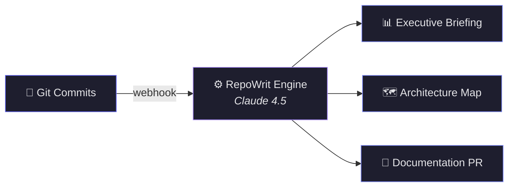

  

<h1 align="center">RepoWrit</h1>

  <strong>Documentation on Autopilot.</strong> 
  Push code. Get docs. That's it.

  <a href="https://repowrit.com">Website</a> · <a href="https://github.com/RepoWrit/repowrit/issues">Community</a> · <a href="https://www.linkedin.com/company/repowrit">LinkedIn</a> · <a href="https://www.producthunt.com/products/repowrit">Product Hunt</a>

---

### What is RepoWrit?

RepoWrit is a GitHub App that turns your git history into executive briefings, architecture maps, and up-to-date documentation — powered by Claude 4.5.

Every commit triggers an AI analysis. Every analysis produces actionable output. No manual effort. No stale READMEs.

---

### How It Works

**1. Connect** — Install the GitHub App. Select your repositories.

**2. Push** — Write code like normal. Every commit triggers RepoWrit.

**3. Ship** — Get AI-generated documentation PRs, executive summaries from Founder/PM/CTO perspectives, architecture visualizations, and semantic search across your entire codebase.

---

### Who It's For

| Audience | What You Get |
|---|---|
| **Founders & CEOs** | Exit-readiness reports, knowledge moat analysis, business impact summaries |
| **Engineering Managers** | PM velocity panels, developer impact scores, effort distribution |
| **CTOs & Architects** | Tech debt trends, architecture maps, risk & dependency analysis |
| **Developers** | Auto-generated READMEs, CHANGELOGs, and doc PRs — zero manual work |

---

### Privacy

Your source code is processed in-memory and **never stored**. We use the Claude 4.5 API with **zero-retention** settings. Your code is never used to train any AI model. [Read our full privacy policy →](https://repowrit.com/privacy)

---

### Plans

| | Hobby | Builder | Scale |
|---|---|---|---|
| **Price** | Free | $14.99/mo | $44.99/mo |
| **Doc Generations** | 5/month | Unlimited | Unlimited |
| **Executive Views** | Founder | Founder + PM | Founder + PM + CTO |
| **Architecture Maps** | — | — | ✓ |
| **PDF Export** | — | — | ✓ |
| **Analysis Window** | 24 hours | 48 hours | 7 days |

[Get started free →](https://repowrit.com)

---

  Built with conviction in India. Powered by Claude 4.5.

