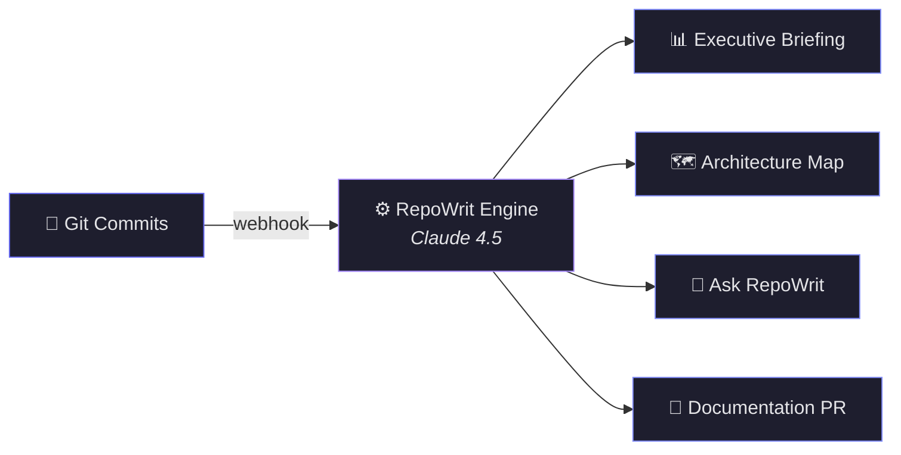

  

<h1 align="center">RepoWrit</h1>

  <strong>Documentation on Autopilot.</strong> 
  Push code. Get docs, executive briefings, and architecture maps. That's it.

  <a href="https://repowrit.com">Website</a> · <a href="https://repowrit.com/pricing">Pricing</a> · <a href="https://repowrit.com/changelog">Changelog</a> · <a href="https://github.com/RepoWrit/repowrit/issues">Community</a> · <a href="https://www.linkedin.com/company/repowrit">LinkedIn</a>

---

### What is RepoWrit?

RepoWrit is a GitHub App that turns your git history into executive briefings, architecture maps, and up-to-date documentation — powered by Claude 4.5.

Every commit triggers an AI analysis. Every analysis produces actionable output. No manual effort. No stale READMEs.

---

### How It Works

```mermaid
graph LR
    A["🔀 Git Commits"] -->|webhook| B["⚙️ RepoWrit Engine<br/><i>Claude 4.5</i>"]
    B --> C["📊 Executive Briefing"]
    B --> D["🗺️ Architecture Map"]
    B --> E["🔎 Ask RepoWrit"]
    B --> F["📄 Documentation PR"]

    style A fill:#1e1e2e,stroke:#6366f1,color:#e4e4e7
    style B fill:#1e1e2e,stroke:#a78bfa,color:#e4e4e7
    style C fill:#1e1e2e,stroke:#818cf8,color:#e4e4e7
    style D fill:#1e1e2e,stroke:#818cf8,color:#e4e4e7
    style E fill:#1e1e2e,stroke:#818cf8,color:#e4e4e7
    style F fill:#1e1e2e,stroke:#818cf8,color:#e4e4e7
```

**1. Connect** — Install the GitHub App. Select your repositories. Multi-branch tracking is supported out of the box.

**2. Push** — Write code like normal. Every commit triggers RepoWrit. The first sync analyzes your last 3 commits instantly so you have a baseline.

**3. Ship** — Get AI-generated documentation PRs, executive summaries (Founder / PM / CTO), architecture visualizations, semantic search ("Ask RepoWrit"), PR reviews, and weekly briefings.

---

### Who It's For

| Audience | What You Get |
|---|---|
| **Founders & CEOs** | Exit-readiness reports, knowledge moat analysis, business impact summaries |
| **Engineering Managers** | PM velocity panels, developer impact scores, effort distribution, Jira sync |
| **CTOs & Architects** | Tech debt trends, architecture maps, security risk flags, dependency analysis |
| **Developers** | Auto-generated READMEs, CHANGELOGs, doc PRs, and PR review comments — zero manual work |
| **Compliance & Ops** | SOC 2 exports, audit trails, governance reports (Team / Enterprise) |

---

### Privacy

Your full source code is **never stored long-term**. Diffs are processed in-memory by Claude 4.5 with **zero-retention** API settings and discarded immediately. Your code is never used to train any AI model. [Read our full privacy policy →](https://repowrit.com/privacy)

---

### Plans

| | Hobbyist | BYOK | Team | Enterprise |
|---|---|---|---|---|
| **Price** | Free | $4.99/mo | $20/seat/mo | $49.99/seat/mo |
| **Doc Generations** | 5/month | Unlimited | Unlimited | Unlimited |
| **Executive Views** | Founder | Founder + PM + CTO | Founder + PM + CTO | Founder + PM + CTO |
| **Ask RepoWrit (semantic search)** | 10/day | Unlimited | Unlimited | Unlimited |
| **Architecture Map** | ✓ | ✓ | ✓ | ✓ |
| **PR Reviews & Commit Timeline** | — | ✓ | ✓ | ✓ |
| **Weekly Email Briefings** | — | ✓ | ✓ | ✓ |
| **Jira Integration & Governance** | — | — | ✓ | ✓ |
| **PDF Export** | — | ✓ | ✓ | ✓ |
| **Analysis Window** | 24 hours | 7 days | 30 days | 30 days |
| **Bring Your Own AI Key** | — | ✓ | ✓ | ✓ |

[Get started free →](https://repowrit.com)

---

  Built with conviction in India. Powered by Claude 4.5.

